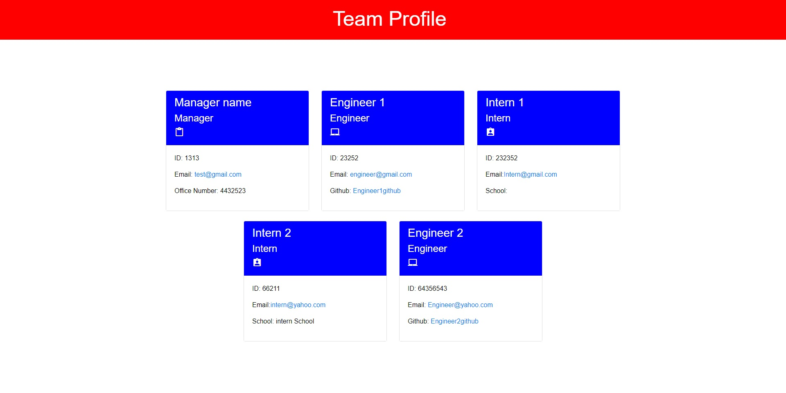

# Team-Profile-Generator

# Screenshot Of Project

# Video Of Project

<a href="https://drive.google.com/file/d/1YbjHv5TBf9WR5LEpj8hXHNRCxJhUC7dA/view?usp=sharing">Link to video</a>

# Description

A terminal based program that will ask the user various questions based on employee members that they wish to add to their team. A html file with profile cards displaying this information will then be made.
My motivation for making this project was to better understand how object oriented programming works, and to get a better grasp of jest and test driven development.

# Installation

This project cannot be run on a webpage and must be used in the source code.

1: Download repo from github. 2: Save where desired. 3: Open file with a text editor of your choice.

# Usage

Before using ensure that you have node installed. You may also need to install the "Inquirer" npm, and "jest" if you wish to run tests.

1: Open the script.js file, this is found in assets/js/script.js. 2: Open the terminal and ensure that you are in the correct directory and have installed the required npm programs. 3: Type "node script.js" in the terminal. 4: Next answer all the prompts you are given. If you wish to add more members then select yes when prompted. 5: Once all promps are answered and you do not wish to add more members simply say no when asked if you want to continue, then a html file will be made in the base directory. Copy this file and save it wherever you please. Just remember to also take the css file linked to it too.

# Testing

If you wish to test the program then open up the terminal inside script.js and type: npm test.
This will run jest and it will test if the constructors are working

# License

MIT License

Copyright (c) [2021] [Matthew Walford]

Permission is hereby granted, free of charge, to any person obtaining a copy of this software and associated documentation files (the "Software"), to deal in the Software without restriction, including without limitation the rights to use, copy, modify, merge, publish, distribute, sublicense, and/or sell copies of the Software, and to permit persons to whom the Software is furnished to do so, subject to the following conditions:

The above copyright notice and this permission notice shall be included in all copies or substantial portions of the Software.

THE SOFTWARE IS PROVIDED "AS IS", WITHOUT WARRANTY OF ANY KIND, EXPRESS OR IMPLIED, INCLUDING BUT NOT LIMITED TO THE WARRANTIES OF MERCHANTABILITY, FITNESS FOR A PARTICULAR PURPOSE AND NONINFRINGEMENT. IN NO EVENT SHALL THE AUTHORS OR COPYRIGHT HOLDERS BE LIABLE FOR ANY CLAIM, DAMAGES OR OTHER LIABILITY, WHETHER IN AN ACTION OF CONTRACT, TORT OR OTHERWISE, ARISING FROM, OUT OF OR IN CONNECTION WITH THE SOFTWARE OR THE USE OR OTHER DEALINGS IN THE SOFTWARE.